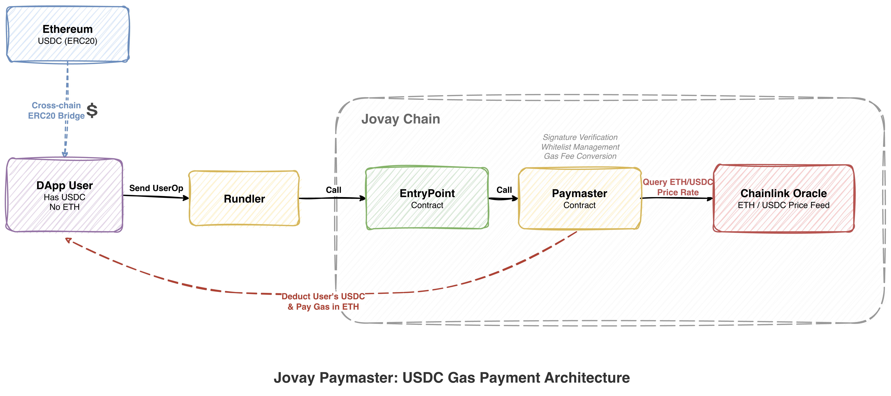

# 🚀 How to Deploy Your Own ERC-4337 Environment on Jovay

## 📖 Introduction

[ERC-4337 (Account Abstraction)](https://eips.ethereum.org/EIPS/eip-4337) is a key standard in the Ethereum ecosystem. By introducing the concept of **UserOperation**, it decouples user transaction intent from actual on-chain execution, enabling developers to build more flexible and user-friendly DApp experiences. With Account Abstraction, DApps can offer capabilities that traditional EOA wallets simply cannot provide:

- 🔗 **Transaction Bundling**: Multiple user operations can be bundled by a Bundler into a single on-chain transaction, reducing overall gas costs;
- 🏦 **Smart Contract Wallets (Smart Accounts)**: A user's "account" is itself a smart contract, supporting advanced features such as multi-signature, social recovery, and permission management;
- ⛽ **Gas Sponsorship (Paymaster)**: Users don't need to hold native tokens (ETH). A third-party Paymaster can pay gas fees on behalf of users, and even allow users to pay transaction fees using ERC-20 tokens (e.g., USDC).

Both Jovay Testnet and Mainnet have deployed the **EntryPoint v0.7** contract, providing developers with out-of-the-box ERC-4337 infrastructure. This tutorial will walk you through setting up a complete ERC-4337 service stack on Jovay step by step 🛠️

## 🎯 What You'll Accomplish

By following this tutorial, you will:

1. ✅ Launch [Rundler](https://github.com/alchemyplatform/rundler) (Alchemy's open-source ERC-4337 Bundler) on Jovay to provide UserOperation bundling and submission services;
2. ✅ Deploy the official Demo Paymaster contract from [Account Abstraction](https://github.com/eth-infinitism/account-abstraction/blob/v0.7.0/contracts/samples/LegacyTokenPaymaster.sol), enabling gas payment via ERC-20 tokens;
3. ✅ Create your own ERC-4337 [Smart Account](https://github.com/eth-infinitism/account-abstraction/blob/v0.7.0/contracts/samples/SimpleAccount.sol) by sending a UserOp, with the Paymaster sponsoring ETH as gas;

> 📌 _We will use **Jovay Testnet** to demonstrate how to achieve the above goals._

## 🌐 Environment Information

| Item | Details |
| --- | --- |
| 🔗 Network | Jovay Testnet, [Network Information](https://docs.jovay.io/developer/network-information#jovay-testnet) |
| 📜 EntryPoint v0.7 | [`0x0000000071727De22E5E9d8BAf0edAc6f37da032`](https://sepolia-explorer.jovay.io/address/0000000071727de22e5e9d8baf0edac6f37da032) |
| 📋 Other Common Contracts | [Contract List](https://docs.jovay.io/resources/auxiliary-contracts#jovay-testnet) |
| 🔑 RPC Service | Register at [ZAN](https://zan.top/service/apikeys) and obtain the Jovay Testnet RPC URL for running Rundler |

> ⚠️ **Note**: It is recommended to purchase a ZAN Professional plan. The free tier has rate limits that are insufficient for running Rundler in a production environment.

## 🧰 Prerequisites

Before getting started, make sure your development environment meets the following requirements:

- 🐳 [Docker](https://docs.docker.com/get-docker/) and Docker Compose installed
- 📦 [Node.js](https://nodejs.org/en/download) installed (version >= 16)
- 🔐 An Ethereum private key ready, with a small amount of Jovay ETH — you can claim free ETH from the [Jovay Testnet Faucet](https://zan.top/faucet/jovay)

## 🔧 Step-by-Step Guide

### 1️⃣ Start the Bundler (Rundler)

[Rundler](https://github.com/alchemyplatform/rundler) is a high-performance ERC-4337 Bundler implementation open-sourced by Alchemy, written in Rust. It is responsible for collecting UserOperations submitted by users from the mempool, performing validation and simulation, and then bundling multiple UserOps into a single on-chain transaction to be submitted to the EntryPoint contract for execution.

We will use Docker to quickly launch Rundler 🐳

#### 📥 Pull the Docker Image

```bash
docker pull alchemyplatform/rundler:v0.10.1
```

#### 📝 Prepare the Chain Configuration File

Create a configuration file `jovay-testnet.toml` for Jovay Testnet:

```toml
name="JovayTestnet"
id=2019775
block_gas_limit=80000000
transaction_gas_limit=16777216
chain_history_size=1
```

> 💡 `chain_history_size` controls the block range that Rundler looks back for on-chain events. To reduce RPC request frequency, it is set to `1` here. For production environments, adjust or remove this configuration as needed.

#### 🐋 Prepare the Docker Compose File

Create a `compose.yml` file, noting the following key points:

- 📂 Replace `/path/to/jovay-testnet.toml` with the actual path
- 🔗 Replace `${ZAN_API_KEY}` with your API Key obtained from ZAN
- 🔑 Set the environment variable `BUILDER_PRIVATE_KEY` to a private key that holds Jovay ETH

```yaml
services:
  rundler:
    image: alchemyplatform/rundler:v0.10.1
    command: node
    ports:
      # RPC port
      - "3000:3000"
      # Metrics port
      - "8080:8080"
    volumes:
      - /path/to/jovay-testnet.toml:/chain.toml
    environment:
      - RUST_LOG=INFO
      - CHAIN_SPEC=/chain.toml
      - NODE_HTTP=https://api.zan.top/node/v1/jovay/testnet/${ZAN_API_KEY}
      - BUILDER_PRIVATE_KEY=${BUILDER_PRIVATE_KEY}
      - DISABLE_ENTRY_POINT_V0_6=true
      - SIGNER_PRIVATE_KEYS=${BUILDER_PRIVATE_KEY}
      - ENABLE_UNSAFE_FALLBACK=true
      - USER_OPERATION_EVENT_BLOCK_DISTANCE=100
      - USER_OPERATION_EVENT_BLOCK_DISTANCE_FALLBACK=100
      - MIN_STAKE_VALUE=0
      - MIN_UNSTAKE_DELAY=0
      - POOL_CHAIN_POLL_INTERVAL_MILLIS=1000
```

> ⚠️ **Production Note**: If you plan to use this configuration in production, you should **remove** the following configuration items for security:
> - `MIN_STAKE_VALUE`
> - `MIN_UNSTAKE_DELAY`
> - `POOL_CHAIN_POLL_INTERVAL_MILLIS`
> - `chain_history_size` in `jovay-testnet.toml`

#### 🚀 Start Rundler

```bash
docker compose up -d
```

Once started, Rundler will provide ERC-4337 JSON-RPC services at `http://localhost:3000`. You can check the logs with `docker compose logs -f` to confirm the service is running properly ✅

---

### 2️⃣ Deploy the Paymaster

This tutorial will guide you through deploying the `LegacyTokenPaymaster` contract to Jovay Testnet.

> 📢 `LegacyTokenPaymaster` is intended for **tutorial demonstration only**. For mainnet deployment, please implement a custom Paymaster contract tailored to your business needs.

#### 💡 What is LegacyTokenPaymaster?

`LegacyTokenPaymaster` is a demo Paymaster contract implementation within the ERC-4337 Account Abstraction framework. It is also an ERC-20 Token contract itself. Its core mechanism works as follows:

| Phase | Behavior |
| --- | --- |
| 🔍 `validatePaymasterUserOp` | Validation phase: Checks whether the user holds enough Paymaster Tokens to confirm sponsorship eligibility |
| 💰 `postOp` | Settlement phase: Deducts the corresponding amount of tokens from the user's Smart Account as gas fee compensation |

**Key Features:**

- 🪙 The Paymaster itself issues an ERC-20 Token, which users use to pay gas fees
- 💱 The Token-to-ETH exchange rate is fixed at **1:100** (i.e., 1 Token = 100 ETH)
- 🏦 The Paymaster must pre-deposit ETH in the EntryPoint contract as the actual gas payment source
- 👤 Users only need to hold the Paymaster-issued tokens to initiate transactions — no ETH required

#### Step 1: 📥 Clone the Repository

```bash
git clone --branch v0.7.0 https://github.com/eth-infinitism/account-abstraction.git
cd account-abstraction
```

#### Step 2: 📦 Install Dependencies

```bash
yarn install
```

#### Step 3: ⚙️ Configure the Network

Edit `hardhat.config.ts` and add the Jovay Testnet configuration under `networks`:

```typescript
jovaytestnet: {
  url: 'https://api.zan.top/public/jovay-testnet',
  accounts: [
    '<YOUR_PRIVATE_KEY>'
  ],
  chainId: 2019775
}
```

> ⚠️ Replace `<YOUR_PRIVATE_KEY>` with your own private key. Make sure the corresponding account has enough Jovay ETH for contract deployment.

#### Step 4: 📜 Download the Paymaster Deployment Script

Download the Paymaster deployment script into the `deploy` directory:

```bash
curl -o deploy/3_deploy_LegacyTokenPaymaster.ts \
  https://gist.githubusercontent.com/zouxyan/985197b398362777d09e8d391656586f/raw/72d1d993b3d1d6c2710e94f6ddbf9796d6b75ce2/3_deploy_LegacyTokenPaymaster.ts
```

This script will automatically perform the following operations:

1. 🏭 Deploy `SimpleAccountFactory` (reuses the existing contract if already deployed)
2. 💳 Deploy the `LegacyTokenPaymaster` contract
3. 💰 Deposit **0.01 ETH** into the Paymaster via `EntryPoint.depositTo` (as the gas sponsorship fund pool)
4. 🪙 Mint `1e18` Paymaster Tokens to the deployer

#### Step 5: 📂 Create EntryPoint Deployment Record

Since the EntryPoint contract is already pre-deployed on Jovay Testnet, but the `hardhat-deploy` plugin requires a local deployment record to reference it. We need to manually create this record file:

```bash
mkdir -p deployments/jovaytestnet
echo '{"address":"0x0000000071727De22E5E9d8BAf0edAc6f37da032","abi":[]}' > deployments/jovaytestnet/EntryPoint.json
echo '2019775' > deployments/jovaytestnet/.chainId
```

> 💡 This step tells the `hardhat-deploy` plugin that the EntryPoint contract already exists at the specified address, so the deployment script can reference it directly without redeploying.

#### Step 6: 🚀 Deploy the Contract

EntryPoint `0x0000000071727De22E5E9d8BAf0edAc6f37da032` is already deployed on Jovay Testnet. You only need to run the Paymaster deployment script:

```bash
npx hardhat deploy --network jovaytestnet --tags LegacyTokenPaymaster
```

#### Step 7: ✅ Verify the Deployment

After successful deployment, the console will output a complete deployment summary with all contract addresses:

```
============================================================
  Deployment Summary
============================================================
  EntryPoint:             0x0000000071727De22E5E9d8BAf0edAc6f37da032
  SimpleAccountFactory:   0x91E60e0613810449d098b0b5Ec8b51A0FE8c8985
  LegacyTokenPaymaster:   0x8FcF8B3f04D4cA04238e3AC9A3312180149f34f5
  Token Name:             MyToken
  Paymaster ETH Deposit:  0.01 ETH
  Signer Token Balance:   1.0
============================================================
```

> 📝 **Please record these contract addresses carefully** — you will need them for subsequent Paymaster interactions.

---

### 3️⃣ Send a UserOperation

Now comes the most exciting part 🎉 Below we demonstrate how to send a UserOperation under the ERC-4337 v0.7 standard via Rundler, creating a **Smart Account** with gas sponsored by the Paymaster.

The core flow of the entire process is as follows:

```
👤 User ──(UserOp)──▶ 📦 Rundler ──(Bundle Tx)──▶ 📜 EntryPoint ──(Call)──▶ 💳 Paymaster
                                                                                   │
                                                                    Deduct Token ◀──┘
```

- 🚫 The user **does not need to hold any ETH**
- ⛽ Gas fees are paid by the Paymaster from its deposit in the EntryPoint
- 🪙 The Paymaster simultaneously deducts an equivalent amount of ERC-20 Tokens from the user's Smart Account as compensation

Continue working in the `account-abstraction` repository for the following steps:

#### Step 1: 📥 Download the Test Script

Navigate to the `test` directory and download the UserOp sending script:

```bash
cd test
curl -o paymaster-uo-create-account.test.ts \
  https://gist.githubusercontent.com/zouxyan/ce2878366f1439d0df78717751350d47/raw/736de648313e14cf6a0e73fdc05ca6f910163dd4/paymaster-uo-create-account.test.ts
```

#### Step 2: ⚙️ Confirm Hardhat Network Configuration

Make sure `hardhat.config.ts` has the target network configured:

```typescript
networks: {
  jovaytestnet: {
    url: 'https://api.zan.top/public/jovay-testnet',
    accounts: ['<deployer-private-key>'],  // Deployer private key with ETH
    chainId: 2019775
  }
}
```

> ⚠️ The address corresponding to the private key in `accounts` **must be the owner of the Paymaster contract** (because the script needs to call `mintTokens` to mint tokens for the new account).

#### Step 3: ▶️ Run the Test

Pass in the three required parameters via environment variables and execute:

```bash
BUNDLER_URL=http://<bundler-host>:<port> \
PAYMASTER_ADDRESS=0x<paymaster-address> \
FACTORY_ADDRESS=0x<factory-address> \
npx hardhat test test/paymaster-uo-create-account.test.ts --network jovaytestnet
```

**📋 Parameter Description:**

| Environment Variable | Description | Example |
| --- | --- | --- |
| `BUNDLER_URL` | Bundler's JSON-RPC address | `http://localhost:3000` |
| `PAYMASTER_ADDRESS` | LegacyTokenPaymaster contract address (from deployment output) | `0x823477...5c926` |
| `FACTORY_ADDRESS` | SimpleAccountFactory contract address (from deployment output) | `0x91E60e...8985` |

#### Step 4: 📊 View Results

The script outputs results in 4 phases. Let's walk through each one:

**🔢 Phase 1 — Calculate Account Address & Mint Tokens**

Calculates the counterfactual address of the user's Smart Account (i.e., a deterministic address that can be computed before the contract is actually deployed), and mints 1 Paymaster Token to that address:

```
============================================================
  Step 1: Calculate Account Address & Mint Tokens
============================================================
  Counterfactual Account:        0x5764934Fa2a000CEcF3331696E2E38D1992461a1
  Paymaster Deposit Before:      0.01 ETH
  Minting 1.0 tokens to account...
  Account Token Balance:         1.0
  ✅ Tokens minted successfully
```

> 💡 **What is a Counterfactual Address?** In ERC-4337, the address of a Smart Account can be deterministically computed using the `CREATE2` opcode before the contract is deployed. This means you can transfer tokens to a contract address that "doesn't exist yet." When the first UserOp triggers the contract deployment, the tokens are already there waiting to be used.

**📤 Phase 2 — Build & Send UserOperation**

Constructs a UserOp and sends it to the Bundler. After the Bundler accepts the UserOp, it returns a UserOp Hash. You can query UserOp details via Rundler's query RPC (refer to the [Alchemy documentation](https://www.alchemy.com/docs/wallets/api-reference/bundler-api/bundler-api-endpoints/eth-get-user-operation-by-hash)):

```
============================================================
  Step 2: Build & Send UserOperation
============================================================
  UserOp Hash:                   0x325eed6f...
  Sender:                        0x5764934F...
  Nonce:                         0x00

  Sending UserOp to bundler...
  Bundler Response Hash:         0x325eed6f...
  ✅ UserOp submitted to bundler
```

**🧾 Phase 3 — UserOp Receipt & Cost Analysis**

Waits for the UserOp to be included on-chain and retrieves the transaction receipt. You can view the transaction details on the [Jovay Testnet Explorer](https://sepolia-explorer.jovay.io/):

```
============================================================
  Step 3: UserOp Receipt
============================================================
  UserOp Hash:                   0x325eed6f...
  Success:                       ✅ true
  Tx Hash:                       0xabc123...
  Block Number:                  12345
  Gas Used (tx):                 350000
  Actual Gas Cost:               0.00035 ETH
  Paymaster:                     0x823477...
```

**💰 Phase 4 — Cost Analysis**

Finally, the cost analysis — this is the part that best demonstrates the value of the Paymaster:

```
============================================================
  Step 4: Cost Analysis
============================================================
  Paymaster Deposit Before:      0.01 ETH
  Paymaster Deposit After:       0.00969775806 ETH
  Paymaster ETH Consumed:        0.00030224194 ETH

  Account Token Before:          1.0
  Account Token After:           0.999997263266
  Account Token Consumed:        0.000002736734
```

As you can clearly see:

- 🏦 The **Paymaster** consumed `0.00030224194 ETH` to cover the actual gas fees
- 🪙 The **user** was only charged `0.000002736734` Paymaster Tokens as compensation
- 🎉 The user **did not spend any ETH at all** and successfully created a Smart Account contract at `0x5764934Fa2a000CEcF3331696E2E38D1992461a1`

---

## 🌟 What's More: Customize Your Own Paymaster

The tutorial above used a demo-level `LegacyTokenPaymaster`. In a real production environment, you can build a much more powerful custom Paymaster 💪

### 💱 Use USDC as the Gas Token

Jovay provides ERC-20 cross-chain capabilities, supporting the bridging of ERC-20 tokens from Ethereum to Jovay. For example, Jovay officially supports [USDC](https://docs.jovay.io/resources/auxiliary-contracts#jovay-mainnet) (on both Mainnet and Sepolia) for cross-chain usage on Jovay. For implementation details, refer to the cross-chain service [tutorial](https://docs.jovay.io/guide/jovay-bridge-dapp-tutorial).

Therefore, you can use **USDC** as the Paymaster's gas sponsorship token — so your DApp users won't need to hold ETH and can initiate "transactions" on Jovay with just USDC 🎉

### 🔮 Integrate Chainlink Oracle for Real-Time Exchange Rates

Jovay has a close partnership with [Chainlink](https://chain.link/), which provides Oracle services for Jovay. By integrating Chainlink Price Feed, your Paymaster contract can:

- 📈 Retrieve real-time **ETH/USDC** exchange rates
- 💱 Perform precise gas fee conversion and collection based on market prices
- 🛡️ Avoid arbitrage risks associated with using fixed exchange rates

### 🏗️ Build Off-Chain Verification Services

Furthermore, your Paymaster can be paired with an **off-chain verification service** to implement the following features in the Paymaster contract:

- ✍️ **Signature Verification**: Only UserOps authorized by the off-chain service's signature can use the Paymaster for gas sponsorship
- 📋 **Whitelist Management**: Restrict Paymaster usage to specific users or contracts only
- 🎫 **Quota Control**: Limit the number of sponsored transactions or the maximum amount per user
- 📊 **Fee Strategies**: Set differentiated fee rates based on user tiers or business scenarios

### 🖼️ Overall Architecture

Users send UserOp requests to Rundler with the Paymaster specified in the request. This allows users to complete on-chain business operations even without holding ETH, as long as they have USDC. The Paymaster deducts the user's USDC while using its own ETH to sponsor the gas fees on the user's behalf.

<!-- Image: CROSS-CHAIN ERC20 BRIDGE QUERY ETH/USDC SEND USEROP PRICE RATE DEDUCT USER'S USDC & PAY GAS IN ETH JOVAY PAYMASTER: USDC GAS PAYMENT ARCHITECTURE -->

